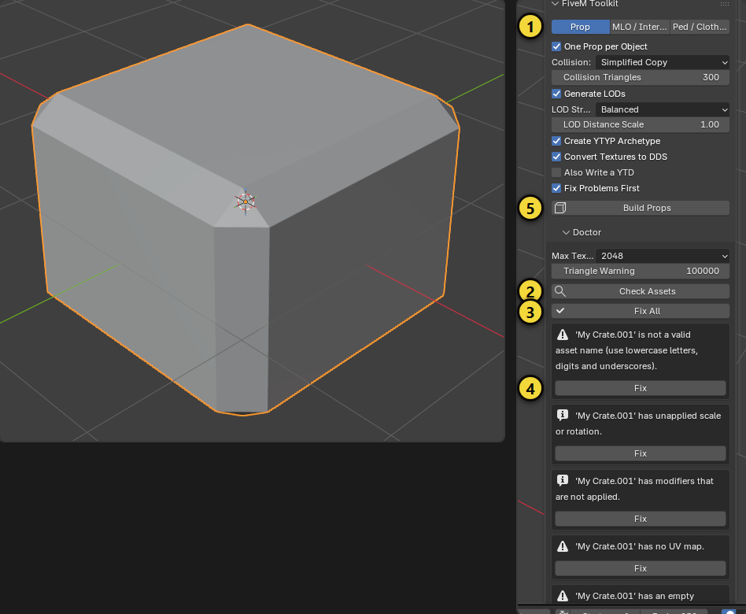
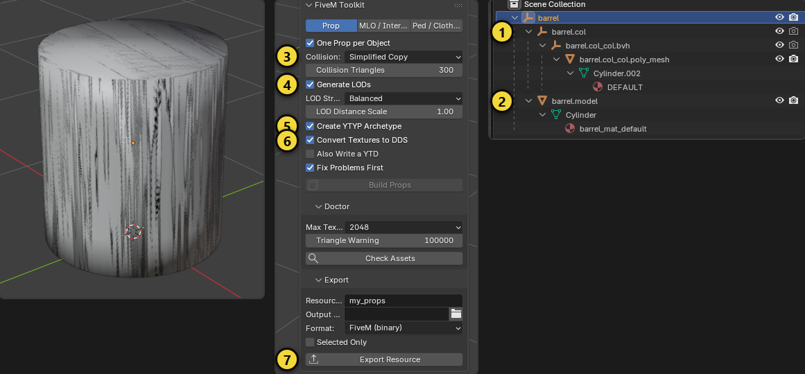
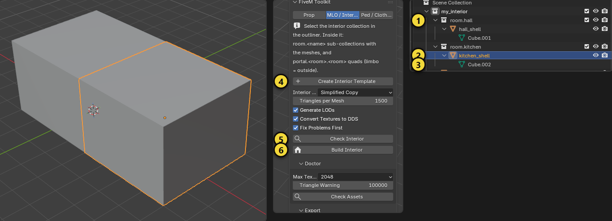
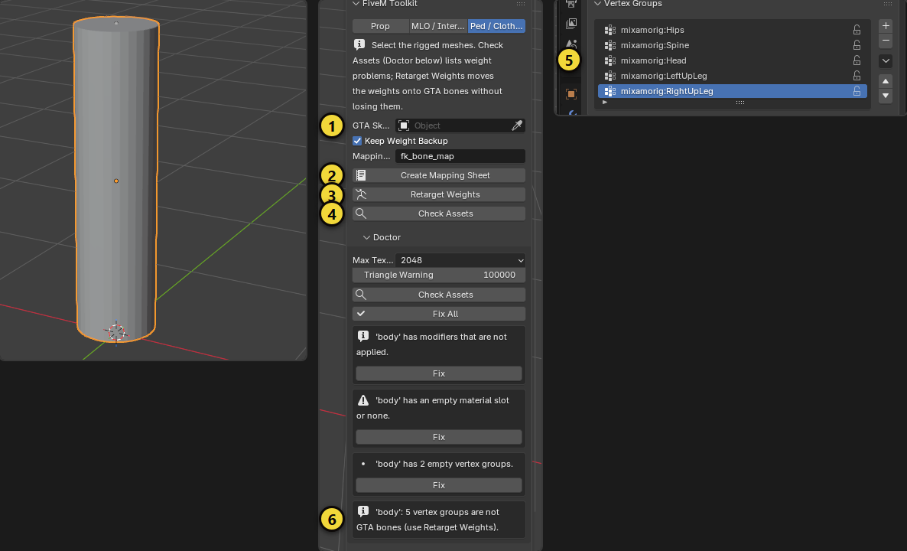

# FiveM Toolkit

Turn plain Blender meshes into FiveM assets with fewer clicks: a **Doctor** that finds what breaks FiveM assets and fixes
the safe problems, a **Prop** builder (drawable, collision, LODs, archetype, DDS textures), an **MLO / Interior** builder
and **Ped** weight tools. It sits on top of [Sollumz](https://docs.sollumz.org), which does the actual GTA V file
conversion; this add-on prepares your scene for it and drives it.

[Türkçe](fivem_toolkit.tr.md) · [Back to the overview](../README.md)


## Requirements

- Blender 5.0 to 5.2.
- **Sollumz** installed and enabled. If it is missing, the panel shows a red notice. Tested with the Sollumz
  development builds 2.8.0 (Blender 5.0) and 2.8.3 (Blender 5.2).

The panel is in the sidebar tab **FiveM**. Choose what you are making with **Prop**, **MLO / Interior** or
**Ped / Clothing**. The **Doctor** and **Export** sub-panels are shared.

## Step-by-step guide

This part explains three workflows with examples: a **prop**, an **MLO / interior** and a **ped / clothing** piece. The
yellow numbers in the pictures match the numbers in the text. The pictures were taken with Blender 5.2 and Sollumz 2.8.3.

> **Enable Sollumz first.** In *Edit > Preferences > Add-ons* type `Sollumz` and tick its box. If it is not enabled the FiveM
> panel shows a red notice. **Where is the panel?** In the 3D view press `N` to open the sidebar and click the **FiveM** tab
> (in the screenshots it appears under the *Item* tab because of how the pictures were taken).

### A. Your first prop: from crate to game

**1. Prepare the model.**

- Model it at **real size**: 1 Blender unit = 1 meter. A crate is about 1 meter.
- The **origin** (the yellow dot of the object) is the pivot in game; put it at the center of the prop's base.
- In the material connect an **Image Texture** to the *Base Color* of the **Principled BSDF**. PNG and JPG are fine, the add-on
  converts them to DDS.

**2. Check and fix with the Doctor.**



1. Select the mesh and click **Prop** in the **FiveM** tab (1).
2. Press **Check Assets** (2). Here the crate is named `My Crate.001`, its scale is not applied, it has a Bevel modifier, no
   UV map and no material. Every problem is listed in plain words.
3. Fix all the safe ones with **Fix All** (3) or one by one with **Fix** (4). The name becomes `my_crate`, scale and modifier
   are applied, a box-projected UV map and a default material are added.
4. Problems that cannot be fixed automatically (a missing texture file, too many triangles, an empty mesh) stay in the list;
   solve those yourself.

**3. Build the prop.**



1. Look at the settings below and press **Build Props** (where 5 is placed in the previous picture; the button is grey when the
   selected object is the prop that was already built):

| Setting | Recommended | What it does |
|---|---|---|
| Collision (3) | *Simplified Copy* | Low-poly collision. Use *Convex Hull* for stones and rocks, *Exact Mesh* for structures you walk inside |
| Collision Triangles | 300 | Enough for a simple prop |
| Generate LODs (4) | On | Versions with fewer triangles for distance |
| LOD Strength / LOD Distance Scale | Balanced / 1.00 | Raise the distance scale on large props |
| Create YTYP Archetype (5) | On | The game needs it to know the prop |
| Convert Textures to DDS (6) | On | FiveM needs DDS |
| Fix Problems First | On | Runs the Doctor's safe fixes first |

2. The result shows in the Outliner on the right: **1** `barrel.col` (the collision embedded in the prop), **2** `barrel.model`
   (the visible mesh with its LODs). The top `barrel` is the Sollumz **drawable**. The material was converted to a Sollumz shader.
3. Run the Doctor again: it should come out clean.

**4. Export.**

1. In the **Export** section of the same panel (7) enter **Resource Name** (for example `my_props`) and **Output Folder**.
   **Format**: *FiveM (binary)*.
2. Press **Export Resource**. The folder you get:

```
my_props/
  fxmanifest.lua        introduces the resource to FiveM
  stream/
    barrel.ydr          model, LODs, embedded collision and textures
    my_props.ytyp       the prop definition (archetype)
```

**5. Try it in game.**

1. Copy the `my_props` folder into your server's `resources` folder and add `ensure my_props` to `server.cfg`.
2. The prop's name in game is the lowercase asset name (`barrel`). Example of spawning it from a script:

```lua
local model = joaat('barrel')
RequestModel(model)
while not HasModelLoaded(model) do Wait(0) end
local prop = CreateObject(model, coords.x, coords.y, coords.z, true, true, false)
```

> The output was checked by exporting through Sollumz and reading it back; **try your first asset in game too.**

### B. MLO / interior

An MLO is described by the **collection layout in the Outliner**. The add-on builds rooms, portals and collision from it.



1. Switch to **MLO / Interior** and press **Create Interior Template** (4). The collection `my_interior` appears:
   - **1** `room.hall` and `room.kitchen`: one sub-collection per room. The boxes in them are placeholders (`hall_shell`).
   - **2** `portal.hall.kitchen`: the opening that joins two rooms. **3** `portal.limbo.hall`: the entrance from outside.
2. **Fill the rooms with your own models.** Delete the placeholder boxes and move each room's meshes into its `room.<name>`
   collection. For a new room add a new `room.<name>` sub-collection. Use lowercase letters, digits and underscores in names.
3. **Place the portals.** A portal is a **single quad** (4 vertices, 1 face) placed in a doorway or window opening. Its name must
   be `portal.<roomA>.<roomB>`; `limbo` is the outside. At least one portal must have `limbo` as one end (the entrance).
4. **Click the `my_interior` collection** in the Outliner to select it; the add-on works on that collection.
5. Press **Check Interior** (5). Problems are listed: a wrong portal name, a portal naming a room that does not exist, no
   entrance, an object in two rooms, more than 12 objects in limbo (GTA allows 12 at most).
6. Press **Build Interior** (6). The room meshes become props, the interior collision is built (*Interior Collision* and
   *Triangles per Mesh*) and the MLO archetype is filled with rooms, portals and entities.
7. Export with **Export Resource**. You get one `.ydr` per room mesh, a `.ybn` for the interior collision and a `.ytyp`.

> **Placing it on the map:** This add-on does not write map placements (`.ymap`). To see the MLO in the world, create a `.ymap` in
> CodeWalker and place the MLO archetype from the `.ytyp`. If a portal looks inverted, swap the two room names in its name.

### C. Ped / clothing: moving weights onto GTA bones

This workflow turns the vertex groups of a clothing or character mesh that was weighted to another rig (Mixamo, Rigify ...)
into the **bone names of the GTA V ped skeleton**; no weight is lost.



1. **Get the GTA skeleton.** Import a ped YFT with Sollumz's import entry in the *File > Import* menu. Put the armature you get into the
   **GTA Skeleton** field (1).
2. Select the rigged meshes, switch to **Ped / Clothing** and press **Check Assets** (4). In the picture the mesh has an
   unapplied modifier, an empty material slot and 2 empty vertex groups, and **5 vertex groups are not GTA bones** (6). The
   vertex groups are in the Properties editor (5): `mixamorig:Hips`, `mixamorig:LeftUpLeg` ...
3. Press **Retarget Weights** (3). The add-on guesses the match from the names (left/right, spine, fingers). A group with no
   GTA counterpart is **merged into the nearest ancestor bone that exists**. With **Keep Weight Backup** on, a hidden backup of
   every mesh is kept.
4. For names it cannot guess press **Create Mapping Sheet** (2). A text block `fk_bone_map` opens and lists the unmatched groups.
   Fill every line as `source bone = GTA bone`, for example:

```
mixamorig:LeftUpLeg = SKEL_L_Thigh
mixamorig:RightUpLeg = SKEL_R_Thigh
```

   Then run **Retarget Weights** again; your lines replace the guesses.
5. Repeat **Check Assets**: the "not GTA bones" warning should be gone. Each vertex may have **at most 4 bone influences** (the
   GTA vertex format stores 4); more shows up as a warning in the Doctor.

> Preparing the ped component files (`.ydd`, `.ytd`, the clothing `.ymt` metadata) is done with Sollumz's own tools; this
> add-on prepares the weights and names. It does not write `.ymt` files.

### Common problems

| Symptom | Cause and fix |
|---|---|
| "Sollumz is not installed or not enabled" | Enable Sollumz in *Preferences > Add-ons* and restart Blender |
| **Build Props** is grey | A **mesh** must be selected (not the already built prop) and you must be in Object Mode |
| "Fix these first: ..." | An error cannot be fixed automatically (for example a missing texture file). Solve it first |
| No LODs appear | The mesh has very few triangles (for example a box). Tiny meshes get no LODs; that is normal |
| The prop is too large or small in game | Scale: 1 Blender unit = 1 meter. Bring the model to real size and let the Doctor apply the scale |
| It does not show in game | Check that `fxmanifest.lua` and `stream/` are in place, that `ensure` is written and that the `.ytyp` is listed; read the server console errors |
| The texture is missing in game | Textures are embedded in the `.ydr`. Keep **Convert Textures to DDS** on and keep texture sizes within **Max Texture Size** |

## Doctor: check and fix

Press **Check Assets** (select the objects, or leave nothing selected to check the scene). Each problem is listed in plain
words with a **Fix** button, or press **Fix All**.

| Problem | Fixed automatically? | What it means |
|---|---|---|
| Invalid or duplicate asset name | Yes | FiveM asset names must be lower-case letters, digits and underscores and unique. |
| Unapplied scale or rotation | Yes | The transform is applied so the prop has the right size in game. |
| Modifiers still on the mesh | Yes | They are applied before conversion. |
| No UV map | Yes | A simple box-projected UV map is generated. Unwrap properly yourself for a good result. |
| No material / unused material slots | Yes | A default material (`fk_default`) is added, unused slots are removed. |
| Texture too large (above **Max Texture Size**, 512 to 4096) | Yes | The texture is scaled down. |
| Texture not DDS | Yes | Converted to DDS with power-of-two sides, never above **Max Texture Size**. See below. |
| Missing texture file | No | Relink or remove the texture. |
| More triangles than **Triangle Warning** (default 100,000) | No | Reduce the mesh, for example with Retopo Kit. |
| Empty mesh | No | Delete it. |

## Prop

Select the meshes and press **Build Props**. For each object (or for all together when **One Prop per Object** is off):

1. The Doctor's safe fixes run first (**Fix Problems First**).
2. The mesh becomes a Sollumz drawable and the materials are converted.
3. **Collision**: *Simplified Copy* (a low-poly copy, default, with **Collision Triangles** as target), *Convex Hull*,
   *Exact Mesh* or *None*.
4. **Generate LODs**: medium, low and very-low versions. **LOD Strength**: *Balanced* (50 / 25 / 10 % of the triangles),
   *Aggressive* (35 / 12 / 4 %) or *Gentle* (70 / 45 / 25 %). Levels that would save almost nothing are skipped, and
   tiny meshes get none. **LOD Distance Scale** multiplies the distances, which are worked out from the prop's size.
5. **Create YTYP Archetype**: a Sollumz archetype for every prop, with the right bounds and LOD distances.
6. **Convert Textures to DDS**: FiveM needs DDS (DXT1 or DXT5 with mipmaps). The add-on has its own encoder and keeps
   the alpha channel when there is one.

Then open **Export**: set **Resource Name** and **Output Folder**, choose **FiveM (binary)** (`.ydr`, `.ybn`, `.ytyp`,
`.ytd`, ready for `stream/`) or **CodeWalker XML**, and press **Export Resource**. You get a resource folder with a
`stream` folder and an `fxmanifest.lua` that already lists the `.ytyp` files. **Selected Only** exports just the selection.

## MLO / Interior

Interiors are described by the outliner structure of one collection:

```
my_interior                  <- select this collection
  room.hall                  <- one sub-collection per room, with its meshes
  room.kitchen
  portal.hall.kitchen        <- a quad that joins two rooms (the opening)
  portal.limbo.hall          <- limbo = the outside; this one is the entrance
```

1. **Create Interior Template** adds a starter layout (two rooms, a portal between them, an entrance). Replace the
   boxes with your own meshes.
2. **Check Interior** lists what is wrong with the rooms and portals (for example a portal that names a missing room, or
   too many objects in limbo: GTA allows 12 at most).
3. **Build Interior** turns the room meshes into props, builds the interior collision (**Interior Collision**:
   simplified copy with **Triangles per Mesh**, or exact mesh), and fills the MLO archetype with rooms, portals and
   entities. **Generate LODs**, **Convert Textures to DDS** and **Fix Problems First** apply here too.
4. Export with **Export Resource** as for props.

## Ped / Clothing

For rigged characters and clothing meshes.

1. Select the rigged meshes. Set **GTA Skeleton** to the ped skeleton you imported from a GTA file (Sollumz YFT import).
2. **Check Assets** lists weight problems: no armature, unweighted vertices, more than 4 bone influences per vertex (the
   GTA vertex format stores 4), weights that do not add up to 1, empty groups, and groups that match no GTA bone.
3. **Retarget Weights** renames and merges the vertex groups onto GTA V bones. It guesses the match from the names
   (Mixamo, Rigify and generic rigs: left/right, spine, fingers ...). Groups with no GTA counterpart are **merged into
   their nearest ancestor bone that exists**, so no weight is lost. A hidden backup copy of each mesh is kept when
   **Keep Weight Backup** is on.
4. For names the add-on cannot guess, press **Create Mapping Sheet**: it makes a text block listing the unmatched groups.
   Fill in `source bone = GTA bone` lines and run **Retarget Weights** again; your lines override the guesses.

The bone names come from Sollumz's own bone registry, so you do not need a skeleton file to validate.

## Limits and good to know

- The output is checked by exporting through Sollumz and reading it back, not by loading it in a live FiveM server or in
  CodeWalker. Test your first asset in game before you build a big pack.
- Textures end up **embedded in the `.ydr`**. A separate `.ytd` is optional (**Also Write a YTD**, off by default,
  needs Sollumz 2.8.3 or newer): the `.ytd` files Sollumz wrote in the tests were much smaller than expected, so they are
  not used by default.
- MLO portal direction follows Sollumz (counter-clockwise seen from the first room in the portal's name). If a portal
  looks inverted in CodeWalker, swap the two room names.
- YMT files (ped metadata, for example `.ymt` for clothing) are not written; Sollumz does not support them.
- This add-on does not touch the game or any server. It only writes asset files.
