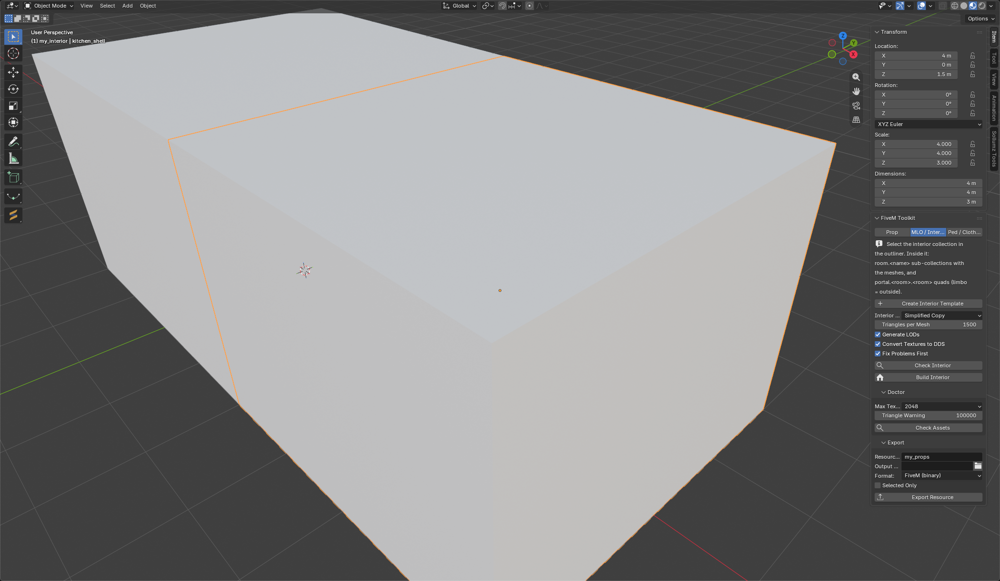

# FiveM Toolkit

Düz Blender mesh'lerini daha az tıklamayla FiveM varlığına çevirir: FiveM varlıklarını bozan şeyleri bulup güvenli
olanları düzelten bir **Doktor**, **Prop** üretici (drawable, collision, LOD, archetype, DDS doku), **MLO / İç Mekân**
üretici ve **Ped** ağırlık araçları. [Sollumz](https://docs.sollumz.org) üzerine kuruludur; GTA V dosya dönüşümünü
Sollumz yapar, bu eklenti sahneni ona hazırlar ve onu yönetir.

[English](fivem_toolkit.md) · [Genel bakışa dön](../README.tr.md)



## Gereksinimler

- Blender 5.0 – 5.2.
- **Sollumz** kurulu ve etkin olmalı. Yoksa panelde kırmızı bir uyarı görünür. Sollumz geliştirme sürümleriyle test
  edildi: 2.8.0 (Blender 5.0) ve 2.8.3 (Blender 5.2).

Panel, yan çubuktaki **FiveM** sekmesindedir. Ne ürettiğini **Prop**, **MLO / Interior** ya da **Ped / Clothing** ile
seç. **Doctor** ve **Export** alt panelleri ortaktır.

## Doktor: kontrol et ve düzelt

**Check Assets**'e bas (objeleri seç; hiçbir şey seçili değilse sahne taranır). Her sorun düz cümleyle ve bir **Fix**
düğmesiyle listelenir, ya da **Fix All**'a bas.

| Sorun | Otomatik düzelir mi? | Anlamı |
|---|---|---|
| Geçersiz ya da çift varlık adı | Evet | FiveM varlık adları küçük harf, rakam ve alt çizgiden oluşmalı ve benzersiz olmalı. |
| Uygulanmamış ölçek ya da dönüş | Evet | Prop oyunda doğru boyda olsun diye transform uygulanır. |
| Mesh üzerinde modifier kalmış | Evet | Dönüştürmeden önce uygulanır. |
| UV haritası yok | Evet | Basit bir kutu izdüşümlü UV haritası üretilir. İyi sonuç için UV'yi kendin aç. |
| Materyal yok / kullanılmayan materyal yuvası | Evet | Varsayılan materyal (`fk_default`) eklenir, kullanılmayan yuvalar silinir. |
| Doku çok büyük (**Max Texture Size** üstü, 512 – 4096) | Evet | Doku küçültülür. |
| Doku DDS değil | Evet | Kenarları 2'nin kuvveti olacak şekilde DDS'e çevrilir, **Max Texture Size**'ı aşmaz. Aşağıya bak. |
| Doku dosyası yok | Hayır | Dokuyu yeniden bağla ya da kaldır. |
| **Triangle Warning**'den fazla üçgen (varsayılan 100.000) | Hayır | Mesh'i azalt, örneğin Retopo Kit ile. |
| Boş mesh | Hayır | Sil. |

## Prop

Mesh'leri seç ve **Build Props**'a bas. Her obje için (**One Prop per Object** kapalıysa hepsi birlikte):

1. Önce Doktor'un güvenli düzeltmeleri çalışır (**Fix Problems First**).
2. Mesh bir Sollumz drawable'ı olur ve materyaller dönüştürülür.
3. **Collision**: *Simplified Copy* (düşük poligonlu kopya, varsayılan, hedef **Collision Triangles**), *Convex Hull*,
   *Exact Mesh* ya da *None*.
4. **Generate LODs**: medium, low ve very-low sürümler. **LOD Strength**: *Balanced* (üçgenlerin %50 / 25 / 10'u),
   *Aggressive* (%35 / 12 / 4) ya da *Gentle* (%70 / 45 / 25). Neredeyse hiç kazanç sağlamayacak seviyeler atlanır,
   çok küçük mesh'lere LOD verilmez. **LOD Distance Scale**, prop'un boyundan hesaplanan mesafeleri çarpar.
5. **Create YTYP Archetype**: her prop için doğru sınırlar ve LOD mesafeleriyle bir Sollumz archetype'ı.
6. **Convert Textures to DDS**: FiveM DDS ister (mipmap'li DXT1 ya da DXT5). Eklentinin kendi kodlayıcısı vardır ve alfa
   kanalı varsa korur.

Sonra **Export**'u aç: **Resource Name** ve **Output Folder**'ı gir, **FiveM (binary)** (`.ydr`, `.ybn`, `.ytyp`,
`.ytd`, `stream/` için hazır) ya da **CodeWalker XML** seç ve **Export Resource**'a bas. Bir `stream` klasörü ve `.ytyp`
dosyalarını zaten listeleyen bir `fxmanifest.lua` içeren kaynak klasörü oluşur. **Selected Only** yalnızca seçimi
aktarır.

## MLO / İç mekân

İç mekânlar, tek bir koleksiyonun outliner yapısıyla tarif edilir:

```
my_interior                  <- bu koleksiyonu seç
  room.hall                  <- her oda için bir alt koleksiyon, mesh'leriyle
  room.kitchen
  portal.hall.kitchen        <- iki odayı birleştiren quad (açıklık)
  portal.limbo.hall          <- limbo = dış mekân; bu giriş kapısı
```

1. **Create Interior Template** bir başlangıç düzeni ekler (iki oda, aralarında portal, bir giriş). Kutuları kendi
   mesh'lerinle değiştir.
2. **Check Interior** oda ve portallardaki hataları listeler (ör. olmayan odayı adlandıran portal, ya da limbo'da çok
   fazla obje: GTA en fazla 12'ye izin verir).
3. **Build Interior** oda mesh'lerini propa çevirir, iç mekân collision'ını kurar (**Interior Collision**: **Triangles
   per Mesh** hedefli basit kopya ya da tam mesh) ve MLO archetype'ını oda, portal ve entity'lerle doldurur.
   **Generate LODs**, **Convert Textures to DDS** ve **Fix Problems First** burada da geçerlidir.
4. Proplardaki gibi **Export Resource** ile dışa aktar.

## Ped / Kıyafet

Rig'li karakterler ve kıyafet mesh'leri için.

1. Rig'li mesh'leri seç. **GTA Skeleton**'a bir GTA dosyasından içe aktardığın ped iskeletini ver (Sollumz YFT içe
   aktarma).
2. **Check Assets** ağırlık sorunlarını listeler: armature yok, ağırlıksız vertex, vertex başına 4'ten fazla kemik etkisi
   (GTA vertex formatı 4 tutar), toplamı 1 etmeyen ağırlıklar, boş gruplar ve hiçbir GTA kemiğine uymayan gruplar.
3. **Retarget Weights** vertex group'ları GTA V kemiklerine göre yeniden adlandırır ve birleştirir. Eşleşmeyi adlardan
   tahmin eder (Mixamo, Rigify ve genel rig'ler: sol/sağ, omurga, parmaklar ...). GTA karşılığı olmayan gruplar **var
   olan en yakın üst kemiğe birleştirilir**, yani hiçbir ağırlık kaybolmaz. **Keep Weight Backup** açıkken her mesh'in
   gizli bir yedeği tutulur.
4. Eklentinin tahmin edemediği adlar için **Create Mapping Sheet**'e bas: eşleşmeyen grupları listeleyen bir metin
   bloğu oluşturur. `kaynak kemik = GTA kemiği` satırlarını doldur ve **Retarget Weights**'i yeniden çalıştır; senin
   satırların tahminlerin yerine geçer.

Kemik adları Sollumz'un kendi kemik kaydından gelir; doğrulamak için iskelet dosyası gerekmez.

## Sınırlar ve bilmen gerekenler

- Çıktı, Sollumz üzerinden dışa aktarılıp geri okunarak denetlendi; canlı bir FiveM sunucusunda ya da CodeWalker'da
  yüklenerek değil. Büyük bir paket yapmadan önce ilk varlığını oyunda dene.
- Dokular **`.ydr` içine gömülür**. Ayrı bir `.ytd` isteğe bağlıdır (**Also Write a YTD**, varsayılan kapalı, Sollumz
  2.8.3 ya da yenisi gerekir): testlerde Sollumz'un yazdığı `.ytd` dosyaları beklenenden çok küçük çıktı, bu yüzden
  varsayılan olarak kullanılmaz.
- MLO portal yönü Sollumz'u izler (portal adındaki ilk odadan bakınca saat yönünün tersi). CodeWalker'da bir portal ters
  görünürse iki oda adını yer değiştir.
- YMT dosyaları (ped metadata, örn. kıyafet `.ymt`) yazılmaz; Sollumz bunu desteklemez.
- Bu eklenti oyuna ya da bir sunucuya dokunmaz. Yalnızca varlık dosyaları yazar.
