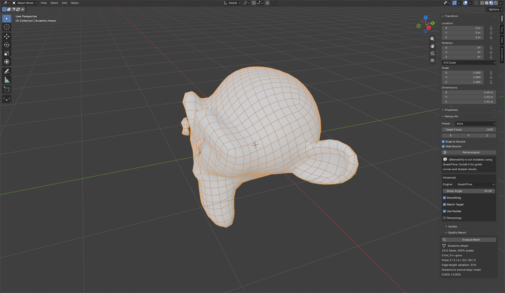

# Retopo Kit

One-click quad retopology for any model: simple props, hard-surface vehicles, characters. Optional guide curves tell the
result where the edge flow must go (eyes, mouth, fingers, panel gaps). A quality report tells you whether the result is
clean.

[Türkçe](retopo_kit.tr.md) · [Back to the overview](../README.md)

## Quick start

1. Select the high-poly or messy mesh.
2. Pick a **Preset** (or leave **Auto**) and set **Target Faces**.
3. Press **Retopologize**. A new object named `<name>_retopo` is created and selected; your original is kept and hidden
   (turn **Hide Source** off to keep it visible).
4. Open **Quality Report** and press **Analyze Mesh** to see how clean the result is.

## Presets

| Preset | Use it for | What it does |
|---|---|---|
| Auto | Anything | Looks at how many sharp edges the mesh has and picks Hard Surface or Organic. |
| Simple Prop | Boxes, crates, simple shapes | Keeps sharp edges (30 degrees) and the boundary, no extra smoothing. |
| Hard Surface / Vehicle | Machines, vehicles, architecture | Keeps sharp edges crisp (30 degrees), no smoothing. |
| Organic / Character | Characters, creatures, sculpts | Smooth flow (80 degrees), smoothing on; only seams act as hard lines. |

Choosing a preset sets **Sharp Angle** and **Smoothing**; you can change both afterwards under **Advanced**.

## Engines

| Engine | Strengths | Notes |
|---|---|---|
| QuadriFlow | Built into Blender, fast | Ignores guide curves. |
| QRemeshify | Better quality, follows sharp edges **and guide curves** | Separate free add-on ([ksami/QRemeshify](https://github.com/ksami/QRemeshify)). |
| Auto (default) | Uses QRemeshify when it is installed, otherwise QuadriFlow | The panel tells you which one is used. |

## Guide curves

Guides are lines the new quads should follow. They work with QRemeshify.

1. Open the **Guides** sub-panel.
2. **Draw Guide** creates a curve and starts Blender's Draw tool with surface projection: drag on the model to draw
   (around an eye, along a mouth, across a panel gap). Repeat for each line.
3. **Apply Guides** converts the selected curves into guide edges on the target mesh (the shortest path along the mesh
   edges between the curve points). Or in Edit Mode, select edges and press **Mark Selected Edges**.
4. Press **Retopologize** with **Use Guides** on. The edges you marked become hard lines the new topology follows.
5. **Clear Guides** removes the marks and restores the seams and sharp edges the mesh had before.

## Other controls

| Control | What it does |
|---|---|
| Symmetry X / Y / Z | Adds a Mirror modifier to the result along that axis. |
| Snap to Source | Adds a Shrinkwrap modifier (`RK Snap`) so later edits stay on the source surface. |
| Hide Source | Hides the original after retopology. |
| Match Target | If the first result is far from Target Faces, runs a second pass (QRemeshify). |
| Sharp Angle | Edges sharper than this stay hard lines. |
| Smoothing | Smooths the result after quadrangulation. |
| Retopology overlay | Shows Blender's retopology overlay in the viewport. |

## Quality report

**Analyze Mesh** measures the active mesh:

- number of faces and the share of quads, triangles and n-gons
- poles (vertices where 3, 5 or 6+ edges meet)
- edge length variation (lower means more even quads)
- distance to the source surface, average and maximum, as a percentage of the model size
- non-manifold edges

A warning appears when less than 90 % of the faces are quads: raise **Target Faces** or add guides.

## Tips

- Remove loose parts and internal faces before you retopologize; the engines work best on a clean closed surface.
- Very dense meshes (over about 90,000 triangles) are decimated automatically on a working copy first, and very sparse
  ones (under about 2,500) are subdivided, so the engines get a sensible input. Your original is never touched.
- For characters, retopologize the body and the clothing as separate objects.
- Retopology gives you a good base, not a finished animation mesh. Check face loops around joints yourself.

## Limits

- Guide curves need QRemeshify; with QuadriFlow they are ignored and the panel says so.
- Results are not identical between different engines or versions.
- The QRemeshify build used in the tests is the Windows one. On macOS and Linux install the matching QRemeshify build;
  Retopo Kit itself is plain Python and falls back to QuadriFlow.
