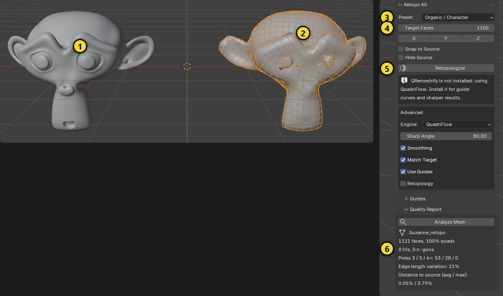
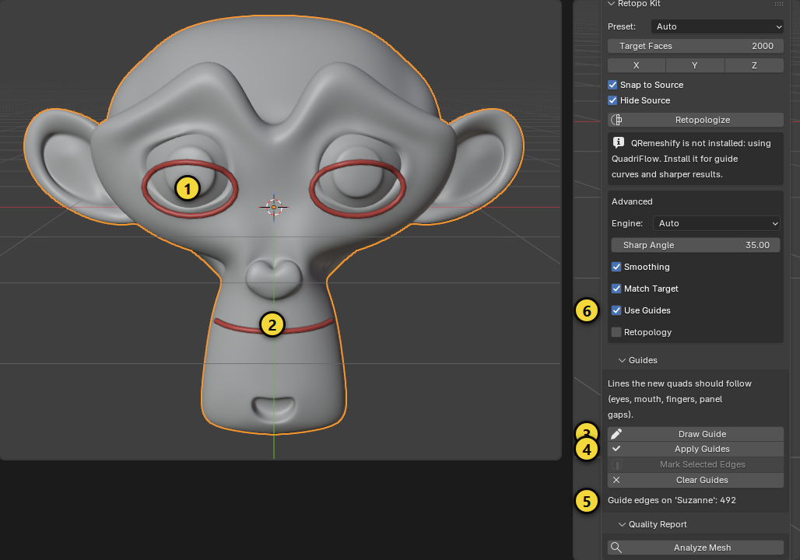
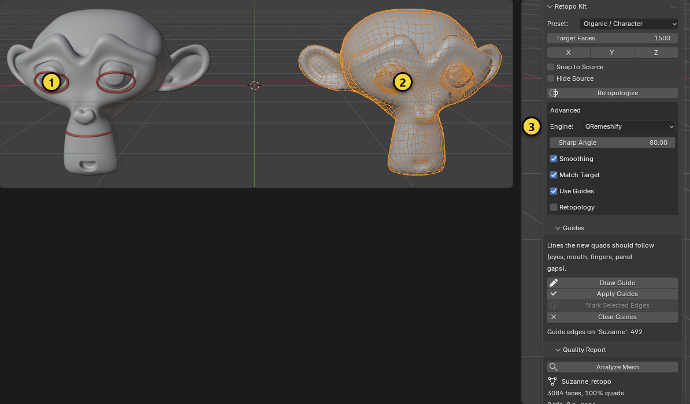

# Retopo Kit

Her model için tek tıkla quad retopoloji: basit proplar, sert yüzey araçlar, karakterler. İsteğe bağlı rehber eğriler
sonucun kenar akışının nereden geçeceğini söyler (göz, ağız, parmak, panel aralıkları). Kalite raporu sonucun temiz olup
olmadığını gösterir.

[English](retopo_kit.md) · [Genel bakışa dön](../README.tr.md)

## Hızlı başlangıç

1. Yüksek poligonlu ya da dağınık mesh'i seç.
2. Bir **Preset** seç (ya da **Auto** bırak) ve **Target Faces** değerini ayarla.
3. **Retopologize**'a bas. `<ad>_retopo` adlı yeni bir obje oluşur ve seçilir; orijinalin korunur ve gizlenir (görünür
   kalsın istersen **Hide Source**'u kapat).
4. **Quality Report** bölümünü aç ve **Analyze Mesh**'e basarak sonucun ne kadar temiz olduğuna bak.

## Adım adım rehber: bir modeli retopolojiye sokmak

Örnek olarak çok yoğun bir maymun kafası kullanıyoruz. Aynı adımlar bir prop, araç ya da karakter için de geçerlidir; farklar
"Hangi modelde ne seçilir" bölümündedir. Görsellerdeki sarı numaralar metindeki numaralarla aynıdır.

> **Panel nerede?** 3B görünümde `N` tuşuyla yan çubuğu açın ve **Retopo Kit** sekmesine tıklayın. Ekran görüntülerinde panel,
> görüntüleri alma yöntemi yüzünden **Item** sekmesinin altında görünür; sizin Blender'ınızda kendi sekmesindedir.

### 1. Hazırlık

- **Temiz, kapalı bir yüzey** verin. Serbest parçaları ve iç yüzleri silin, *Edit Mode > Mesh > Clean Up > Merge by Distance*
  ile üst üste vertex'leri birleştirin. Ölçek ve dönüşü uygulayın (`Ctrl+A > All Transforms`).
- Modifier'ları (Subdivision gibi) **uygulayın**; retopoloji ekrandaki son şekli değil, mesh verisini kullanır.
- **QRemeshify** kuruluysa en iyi sonucu o verir ve rehber çizgileri yalnızca o izler. Kurulu değilse Blender'ın QuadriFlow'u
  kullanılır; panel bunu bir uyarıyla söyler.

### 2. Tek tıkla retopoloji

1. Kaynak modeli seçin (görselde **1**, solda). Object Mode'da olun.
2. **Preset** (3): Kafa için *Organic / Character* seçin.
3. **Target Faces** (4): Sonucun yaklaşık yüz sayısı. Burada 1100.
4. **Retopologize**'a basın (5). `<ad>_retopo` adlı yeni bir obje oluşur (görselde **2**, sağda tel kafes olarak). Orijinal
   varsayılan olarak gizlenir; bu görselde karşılaştırma için **Hide Source** kapalıdır.
5. **Quality Report** (6) sonuç için otomatik doldurulur:

| Değer | İyi sonuç | Anlamı |
|---|---|---|
| Quad oranı | %95 ve üstü | Üçgen ve n-gon az olmalı. %90 altında panel uyarır |
| Poles 3 / 5 / 6+ | 6+ sıfır, 3 ve 5 az | Pole'lar kenar akışının düğüm noktalarıdır; az ve düzgün yerleşmiş olmalı |
| Edge length variation | %25 altı | Quad'ların ne kadar eşit olduğu |
| Distance to source | %1 altı | Sonuç kaynağa ne kadar yakın. Büyükse hedef yüz sayısını artırın |
| Non-manifold | 0 | Delik ya da çift kenar yok |

Sonuç yeterli değilse **Preset**'i değiştirin ya da **Target Faces**'i artırıp tekrar deneyin; her denemede yeni bir
`_retopo` objesi oluşur, eskiyi silebilirsiniz.

### 3. Rehber çizgilerle akışı yönlendirin (QRemeshify)

Rehber çizgiler, yeni quad'ların izlemesi gereken yollardır: gözün çevresi, ağız, parmaklar, araçta kapı ve cam kenarları.

1. Kaynak modeli seçin ve panelde **Guides** alt panelini açın.
2. **Draw Guide**'a basın (3). Blender `RK Guide` adlı bir eğri oluşturur, Edit Mode'a ve **Draw** aracına geçer. Modelin üstünde
   fareyi **basılı tutarak sürükleyin**: çizgi yüzeye yapışır. Her sürükleme ayrı bir çizgidir; gözler ve ağız için hepsini
   aynı eğride çizebilirsiniz (görselde **1** göz çevresi, **2** ağız).
3. **Apply Guides**'a basın (4). Eğri, hedef mesh'in kenarları boyunca en kısa yola çevrilir ve o kenarlar işaretlenir;
   paneldeki *Guide edges on '...'* sayacı (5) kaç kenar işaretlendiğini gösterir. Edit Mode'dan kendiliğinden çıkılır.
4. **Modeli tekrar tıklayarak seçin.** Retopologize seçili ve aktif mesh üzerinde çalışır, eğriyi değil.

*Alternatif:* Edit Mode'da kendi seçtiğiniz kenarlar için **Mark Selected Edges** kullanın; çizim gerekmez.

Rehberleri silmek için **Clear Guides**: işaretler kalkar ve mesh'in eski seam ve keskin kenar işaretleri geri gelir.

### 4. Rehberli retopoloji

1. **Engine**'i *QRemeshify* yapın (3) ya da *Auto* bırakın, **Use Guides** (önceki görselde 6) açık olsun.
2. **Retopologize**'a basın.
3. Sonuçta (görselde **2**, sağdaki tel kafes) gözlerin çevresinde rehberi izleyen **eş merkezli kenar döngüleri** oluşur.
   Soldaki kırmızı çizgiler (**1**) kaynakta kalır; işiniz bitince **Clear Guides** ile temizleyin.

Rehber kullanmazsanız aynı model gözlerde gelişigüzel üçgen ve düğümlerle sonuçlanır; döngüler animasyonda göz kapaklarının
doğru kıvrılması için gereklidir.

### Hangi modelde ne seçilir

| Model | Preset | Target Faces (yaklaşık) | Ek ipuçları |
|---|---|---|---|
| Sandık, varil, basit prop | Simple Prop | 300 – 1500 | Rehber gerekmez. Motor ister QuadriFlow ister QRemeshify |
| Araç gövdesi | Hard Surface / Vehicle | 4 000 – 10 000 | **Sharp Angle** 30. Kapı aralığı, cam çerçevesi ve farlar için rehber çizin. Araç simetrikse ve merkezi dünya orijinindeyse **X** simetrisini açın |
| Karakter gövdesi | Organic / Character | 8 000 – 15 000 | Gövdeyi ve kıyafeti **ayrı objeler** olarak retopolojiye sokun |
| Karakter kafası | Organic / Character | 3 000 – 6 000 | Gözler, ağız, burun kanatları ve kaşlar için rehber çizin |
| Heykel ya da scan | Organic / Character | İstediğiniz yoğunluk | Yoğun mesh (90 000 üçgen üstü) otomatik seyreltilir |

Yan seçenekler: **Symmetry X / Y / Z** sonuca Mirror modifier'ı ekler (merkez, nesnenin orijinidir), **Snap to Source**
sonraki düzenlemeler kaynak yüzeyde kalsın diye Shrinkwrap ekler.

### 5. Sonuçtan sonra

- Eklem çevresindeki kenar döngülerini (diz, dirsek, omuz) animasyon için elle düzeltin; retopoloji iyi bir **temel** verir.
- UV açın ve yüksek poligonlu kaynaktan alçak poligonluya doku **bake** edin (*Render Properties > Bake*, *Selected to Active*).
- FiveM için sonuç mesh'ini **FiveM Toolkit**, Unreal için **UE5 Bridge** ile dışa aktarın.

### Sık karşılaşılan sorunlar

| Belirti | Sebep ve çözüm |
|---|---|
| **Retopologize** düğmesi gri | Object Mode'da ve bir mesh seçili olmalı. Rehber çizdikten sonra modeli tekrar tıklayın |
| "QRemeshify is not installed" | QuadriFlow kullanılır; rehber çizgiler yok sayılır. QRemeshify'ı kurun |
| Sonuç çok yoğun ya da çok seyrek | **Target Faces** yaklaşık bir hedeftir. Değeri değiştirip tekrar deneyin, **Match Target** ikinci bir geçiş yapar |
| Kaynaktan uzak sonuç | Mesh'te delik ya da non-manifold kenar olabilir. *Merge by Distance* ve *Fill Holes* ile onarın |
| İşlem uzun sürüyor | Mesh'in çok yoğun olması normaldir; eklenti 90 000 üçgen üstünü önce seyreltir |
| Sert kenarlar yumuşadı | **Sharp Angle** değerini düşürün ya da *Hard Surface* preset'ini seçin |

## Ön ayarlar

| Ön ayar | Ne için | Ne yapar |
|---|---|---|
| Auto | Her şey | Mesh'te kaç keskin kenar olduğuna bakar, Hard Surface ya da Organic seçer. |
| Simple Prop | Kutu, sandık, basit şekiller | Keskin kenarları (30 derece) ve sınırı korur, ek yumuşatma yok. |
| Hard Surface / Vehicle | Makine, araç, mimari | Keskin kenarları net tutar (30 derece), yumuşatma yok. |
| Organic / Character | Karakter, yaratık, sculpt | Yumuşak akış (80 derece), yumuşatma açık; yalnızca seam'ler sert çizgi olur. |

Ön ayar seçmek **Sharp Angle** ve **Smoothing** değerlerini ayarlar; sonra **Advanced** altında değiştirebilirsin.

## Motorlar

| Motor | Güçlü yanı | Not |
|---|---|---|
| QuadriFlow | Blender'a dahil, hızlı | Rehber eğrileri yok sayar. |
| QRemeshify | Daha iyi kalite, keskin kenarları **ve rehber eğrileri** izler | Ayrı, ücretsiz eklenti ([ksami/QRemeshify](https://github.com/ksami/QRemeshify)). |
| Auto (varsayılan) | Kuruluysa QRemeshify, değilse QuadriFlow kullanır | Panel hangisinin kullanıldığını söyler. |

## Rehber eğriler

Rehberler, yeni quad'ların izlemesi gereken çizgilerdir. QRemeshify ile çalışır.

1. **Guides** alt panelini aç.
2. **Draw Guide** bir eğri oluşturur ve Blender'ın Draw aracını yüzeye izdüşümle başlatır: modelin üstünde sürükleyerek
   çiz (gözün etrafı, ağız boyunca, panel aralığı boyunca). Her çizgi için tekrarla.
3. **Apply Guides** seçili eğrileri hedef mesh üzerinde rehber kenarlara çevirir (eğri noktaları arasında mesh
   kenarları boyunca en kısa yol). Ya da Edit Mode'da kenarları seçip **Mark Selected Edges**'e bas.
4. **Use Guides** açıkken **Retopologize**'a bas. İşaretlediğin kenarlar, yeni topolojinin izlediği sert çizgiler olur.
5. **Clear Guides** işaretleri kaldırır ve mesh'in önceki seam ve keskin kenarlarını geri yükler.

## Diğer kontroller

| Kontrol | Ne yapar |
|---|---|
| Symmetry X / Y / Z | Sonuca o eksende bir Mirror modifier ekler. |
| Snap to Source | Sonraki düzenlemeler kaynak yüzeyde kalsın diye Shrinkwrap modifier'ı (`RK Snap`) ekler. |
| Hide Source | Retopolojiden sonra orijinali gizler. |
| Match Target | İlk sonuç Target Faces'ten uzaksa ikinci geçiş yapar (QRemeshify). |
| Sharp Angle | Bundan keskin kenarlar sert çizgi olarak kalır. |
| Smoothing | Quad'a çevirmeden sonra sonucu yumuşatır. |
| Retopology overlay | Blender'ın retopoloji katmanını görünümde gösterir. |

## Kalite raporu

**Analyze Mesh** aktif mesh'i ölçer:

- yüz sayısı ile quad, üçgen ve n-gon oranı
- pole'lar (3, 5 veya 6+ kenarın birleştiği vertex'ler)
- kenar uzunluğu değişimi (düşük = daha düzgün quad'lar)
- kaynak yüzeye uzaklık, ortalama ve en büyük, model boyutunun yüzdesi olarak
- non-manifold kenarlar

Yüzlerin %90'ından azı quad ise uyarı çıkar: **Target Faces**'i artır ya da rehber ekle.

## İpuçları

- Retopolojiden önce serbest parçaları ve iç yüzleri temizle; motorlar temiz, kapalı yüzeyde en iyi çalışır.
- Çok yoğun mesh'ler (yaklaşık 90.000 üçgenin üstü) önce bir çalışma kopyasında otomatik seyreltilir, çok seyrekler
  (yaklaşık 2.500'ün altı) bölünür; böylece motorlara makul bir girdi gider. Orijinaline dokunulmaz.
- Karakterde gövdeyi ve kıyafeti ayrı objeler olarak retopolojiye sok.
- Retopoloji iyi bir temel verir, bitmiş animasyon mesh'i değil. Eklem çevresindeki kenar döngülerini kendin kontrol et.

## Sınırlar

- Rehber eğriler QRemeshify ister; QuadriFlow ile yok sayılır ve panel bunu söyler.
- Farklı motor ya da sürümler aynı sonucu vermez.
- Testlerde kullanılan QRemeshify yapısı Windows içindir. macOS ve Linux'ta uygun QRemeshify yapısını kur; Retopo Kit
  düz Python'dur ve QuadriFlow'a geri düşer.
