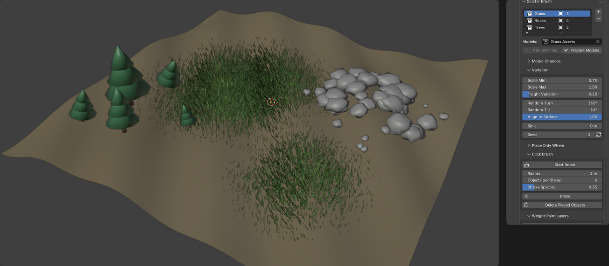
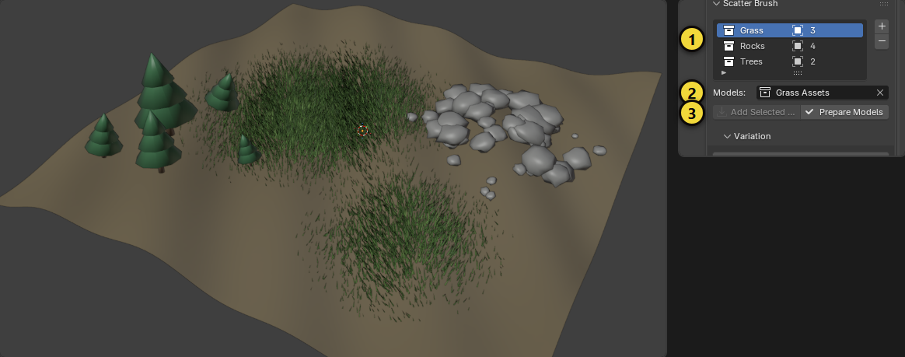
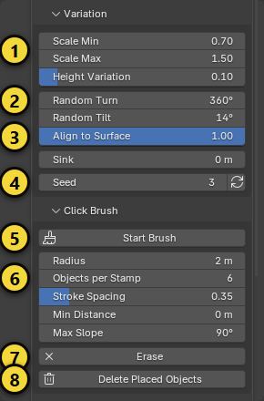
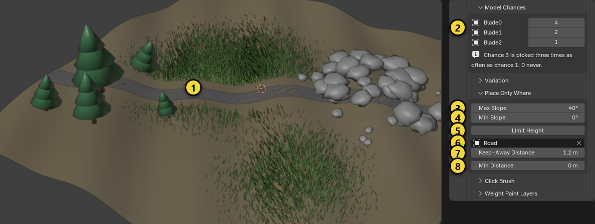
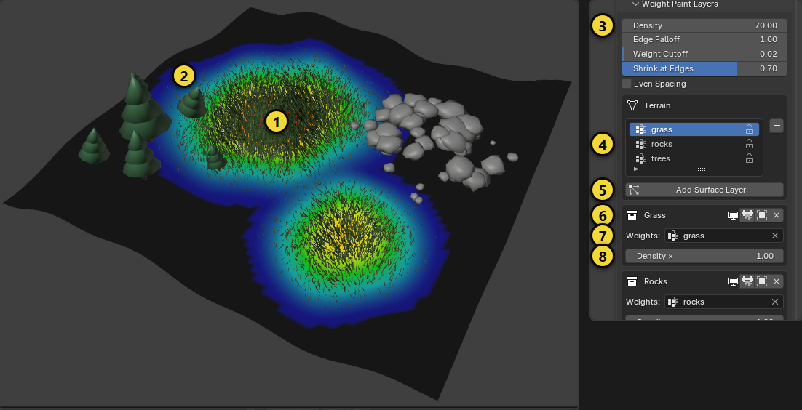
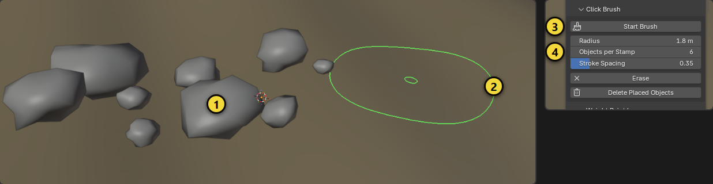

# Scatter Brush (Serpiştirme Fırçası)

Çimen, taş, ağaç ya da istediğin herhangi bir modeli seviyeye iki yolla yay: zemine **vertex group boyayıp** modellerin
orada yumuşak bir yoğunluk geçişiyle çıkmasını sağla ya da viewport'ta **fırçayla tıklayıp sürükleyerek** elle yerleştir.
İkisi de aynı **kategorileri** kullanır: kategori, bir model takımıdır (örneğin 15 taş ya da 5 çimen modeli) ve onun için
kaydettiğin tüm rastgelelik ayarlarıdır.

Scatter Brush, Terrain Blend gibi genel amaçlı bir eklentidir: her Blender sahnesinde çalışır ve Unreal Engine
eklentilerinin hiçbirine ihtiyaç duymaz. (Oyun seviyesi yapıyorsan yerleştirilen objeler, her dışa aktarıcının aldığı sıradan
objelerdir.)

[English](scatter_brush.md) · [Genel bakışa dön](../README.tr.md)

Panel, kenar çubuğunun **Scatter** sekmesindedir (3D görünümde `N`; ekran görüntülerinde resimler öyle çekildiği için
*Item* sekmesinin altında görünür). Blender 5.0.1 ve 5.2.0'da test edildi. Resimlerdeki sarı numaralar metindeki
numaralarla eşleşir.

## Hızlı başlangıç

1. Modellerini (çimen, taş, ağaç) seç ve **Scatter** sekmesinde **+** düğmesine bas. Bir kez **Modelleri Hazırla**'ya bas.
2. **Çeşitlilik**'i aç; istediğin boyut, dönüş ve eğilmeyi ayarla. Bu, kategoriyle birlikte kaydedilir.
3. **Boyadığın yere serpiştirmek için:** zemini seç, vertex group aç, **Yüzey Katmanı Ekle**'ye bas, sonra katmanın weight
   paint simgesine basıp boya.
4. **Elle yerleştirmek için:** **Fırçayı Başlat**'a bas, sonra zeminde tıkla ya da sürükle. `Shift` + tık siler, `Esc` bitirir.
5. Hangi modelin nereye gideceğini **Model Olasılıkları** ve **Sadece Şurada Yerleştir** ile söyle. Taşıyıp dışa aktarabileceğin
   gerçek objeler istediğinde **Objelere Dönüştür**'e bas.

## 1. Kategori oluştur

1. Modellerini seç (örneğin 5 çimen modeli) ve listedeki **+** düğmesine bas. Scatter Brush ilk modelin adıyla bir kategori
   açar ve modelleri **kendi collection'larına taşır** (`<ad> Assets`). Bu collection view layer'dan çıkarılır; böylece
   orijinaller seviyende durmaz ama kaynak olarak çalışmaya devam eder. Görünür kalmalarını istersen redo panelinde
   *Modelleri Gizle*'yi kapat. Her tür için bir kategori yap: Çimen, Taş, Ağaç.
2. **Modeller** aktif kategorinin collection'ını gösterir. Başka bir collection'a sürükleyebilir ya da daha fazla model
   ekleyebilirsin: objeleri seç ve **Seçileni Ekle**'ye bas (3, sol).
3. **Modelleri Hazırla** (3, sağ) her modelin ölçek ve döndürmesini uygular, origin'i **alt ortaya** koyar. Bir kez yap:
   origin, zemine değen noktadır ve rastgele ölçek objenin zaten sahip olduğu ölçekle çarpılır. Bir modelin buna ihtiyacı
   olunca kırmızı bir uyarı çıkar. Mesh'ini başka bir objeyle paylaşan, parent'ı olan ya da mesh olmayan modeller atlanır ve
   mesajda sayılır.

## 2. Rastgelelik (iki kipte de aynı)

Buradaki her şey aktif kategoriye aittir ve dosyayla birlikte kaydedilir.

| # | Ayar | Ne yapar |
|---|---|---|
| 1 | **En Küçük / En Büyük Boyut** | Her obje iki değer arasında rastgele bir boyut alır. **Boy Farkı** bunun üstüne sadece boyu uzatır; bitkiler genişlikten çok boyda farklılaşır. |
| 2 | **Rastgele Dönüş / Rastgele Eğilme** | Yukarı eksen etrafındaki en büyük rastgele dönüş (360 serbest dönüştür) ve ekseninden en büyük rastgele eğilme. |
| 3 | **Yüzeye Hizala** | 0 her şeyi dik tutar, 1 zeminin eğimini izler. |
| 4 | **Gömme**, **Tohum** | Objeleri zemine gömer (yarı gömülü taş) ve rastgele desen. Ok düğmesi yeni tohum seçer. |
| 5 | **Fırçayı Başlat** | Tıklama fırçası, 5. bölüme bak. |
| 6 | **Yarıçap, Tıklama Başına Obje, Sürükleme Aralığı** | Tıklama fırçası ayarları, 5. bölüme bak. |
| 7 | **Sil** | Fırçayı silme kipine alır (ayrıca: `Shift` basılı tut ya da `E`). |
| 8 | **Yerleştirilenleri Sil** | Fırçanın ya da bake'in bu kategori için yerleştirdiği her objeyi siler. |

## 3. Hangi model, nerede: olasılıklar ve filtreler

Bu ayarlar yüzey katmanlarında da tıklama fırçasında da aynen geçerlidir.

- **Model Olasılıkları** (2): her modelin 0 ile 10 arası bir olasılığı vardır. Olasılığı 3 olan model, 1 olandan üç kat sık
  seçilir; 0 hiç seçilmez. Bir taşı yaygın, başkasını nadir yapmak için kullan. Tüm olasılıklar eşitse fazladan bir şey
  kurulmaz; değilse gizli bir *Seçim Listesi* collection'ı modelleri olasılıklarına göre tekrarlar (ona dokunma, yeniden kurulur).
- **En Çok Eğim / En Az Eğim** (3, 4): bu açıdan dik ya da düz yüzeyleri atlar. Çimen sadece hafif eğimde, taş sadece
  uçurumda olsun. 90 ve 0 sınır yok demektir.
- **Yüksekliği Sınırla** (5): sadece bir en alt ve bir en üst yükseklik arasına yerleştirir; örneğin kar sınırının üstünde ağaç
  olmasın. Katmanlar bunu zeminin kendi uzayında ölçer (zemin başlangıç noktasındaysa dünya uzayıyla aynıdır); fırça dünya
  uzayını kullanır.
- **Şundan Uzak Tut** (6) ve mesafesi (7): yol, patika ya da bina gibi bir mesh seç; ondan bu mesafe içinde hiçbir şey çıkmaz
  (1). Her mesh ile çalışır; fırçada da mesafe mesh yüzeyine göre ölçülür.
- **En Az Mesafe** (8): hiçbir iki obje bundan yakın olmaz. Fırça her zaman uyar; yüzey katmanları bunu **Eşit Aralık** ile
  kullanır.

## 4. Ağırlık boyadığın yere serpiştir

1. **Zemin mesh'ini** seç ve kategoriyi seç (örneğin *Grass*). Grup listesindeki **+** (4) ile zeminde bir vertex group aç,
   adını ver (`grass`) ve seçili bırak. **Önce zeminin ölçek ve döndürmesini uygula** (`Ctrl+A`): objeler zeminin
   uzayında yaşar ve ikisini de miras alır. Gerekince kırmızı bir uyarı çıkar.
2. **Yüzey Katmanı Ekle**'ye bas (5). Katman aşağıda belirir (6), kullandığı grupla birlikte (7). Grup boş olduğu için
   henüz bir şey çıkmaz: ağırlığı her yerde 0'dır.
3. Katmanın **weight paint** simgesine bas (6, görünürlük simgesinden sonraki ilk simge). Blender o grupla Weight Paint'e
   geçer; çimenin tam olmasını istediğin yeri ağırlık 1 ile, sönmesini istediğin yeri daha azıyla boya. Boyarken modeller
   canlı olarak belirir (1). İşin bitince Object Mode'a dön.
4. Alan **yumuşakça söner**: yoğunluk, yüz yüz değil, her yüzün her noktasındaki ağırlığı izler (2). Panelden ayarla (3):

   | Ayar | Ne yapar |
   |---|---|
   | **Yoğunluk** | Ağırlığın 1 olduğu yerde metrekare başına obje. Katmandaki **Yoğunluk ×** (8) bunu sadece o zemin için çarpar. |
   | **Kenar Sönümü** | 1 ağırlığı doğrusal izler, 2 ve üstü zayıf ağırlıklara doğru objeleri daha hızlı seyreltir; yamanın kenarı sıkılaşır. |
   | **Ağırlık Eşiği** | Bu değer ve altındaki ağırlıklara hiç obje konmaz. |
   | **Kenarda Küçült** | Ağırlığın zayıf olduğu yerde objeler küçülür; çimenliğin kenarı kısa çimenden oluşur. |
   | **Eşit Aralık** | İki obje arasında **En Az Mesafe**'yi korur (ağaç ve taş için iyi; biraz daha yavaş). |
   | **Viewport Yoğunluğu** (9) | Viewport'ta objelerin sadece bir kısmını gösterir; büyük bir çayırı boyarken örneğin %20. Görünenler tam desenin bir alt kümesidir; render ve **Objelere Dönüştür** her zaman hepsini kullanır. |

5. Başka kategoriler için daha fazla katman ekle (`rocks` grubunda Taş, `trees` grubunda Ağaç). Katman bir Geometry Nodes
   modifier'ıdır; ekran simgesi kapatır, çarpı kaldırır. Ağırlık alanını boş bırakırsan tüm yüzeye serpiştirir. **Terrain
   Blend** katmanını maskeleyen vertex group burada da işe yarar: çimen dokusunu ve çimen modellerini aynı grupla boya.
6. **Objelere Dönüştür** (6, ortadaki simge) katmanı taşıyabileceğin, silebileceğin ya da tek tek dışa aktarabileceğin
   gerçek objelere çevirir. Bunlar bağlı kopyalardır (modelin mesh'ini paylaşır), `<kategori> Placed` collection'ına konur
   ve katman kaldırılır (redo paneli katmanı tutabilir). 20 000'den fazla obje reddedilir: önce yoğunluğu düşür.

## 5. Tıklama fırçası

Bir kategori seç ve **Fırçayı Başlat**'a bas (3). Yeşil daire farenin altındaki yüzeyi izler ve tümseklerin üstüne oturur (2).

| Eylem | Sonuç |
|---|---|
| Sol tık | Dairenin içine **Tıklama Başına Obje** kadar obje koyar (1); her biri kategorideki rastgele bir model, boyut, dönüş ve eğilmeyle gelir. |
| Sol tık + sürükle | Fare **Sürükleme Aralığı** × yarıçap kadar gittikçe yeniden yerleştirir. |
| `Shift` + sol tık ya da `E` | Silme kipi: dairenin içindeki, kategorinin fırça objelerini kaldırır (daire kırmızı olur). |
| `Ctrl` + tekerlek ya da `[` ve `]` | **Yarıçapı** değiştirir. Tek başına tekerlek ve orta tuş görünümü hareket ettirmeye devam eder. |
| `Esc`, `Enter` ya da sağ tık | Aracı bitirir. |

Ayarlar (4): **Yarıçap** (0 tam imlecin olduğu yere koyar), **Tıklama Başına Obje** ve **Sürükleme Aralığı**; 3. bölümdeki
eğim, yükseklik, uzak tutma ve en az mesafe filtreleri de geçerlidir. Her fırça darbesi tek bir geri alma adımıdır. Fırça
zemini ararken kendi objelerini yok sayar; bu yüzden daha önce doldurduğun alanın üstünden de boyayabilirsin.

Yerleştirilen objeler `<kategori> Placed` içindeki sıradan bağlı kopyalardır; Blender'ın geri kalanı (taşı, sil, dışa
aktar) onlarla her obje gibi çalışır.

## Uygulamalı örnekler

### A. Patikalı bir çayır

1. Farklı boylarda üç çimen modeli seç, **+** ve **Modelleri Hazırla**'ya bas.
2. **Model Olasılıkları**'nı aç: uzun çimene 2, iki kısa çimene 4 ve 3 ver; böylece kısa çimen en yaygın olur.
3. **Çeşitlilik**'te En Küçük Boyut 0.7, En Büyük Boyut 1.4, Boy Farkı 0.2, Rastgele Eğilme 12° ve Yüzeye Hizala 1 yap.
4. Zemini seç (ölçek ve döndürmesi uygulanmış), grup listesindeki **+** ile `meadow` adlı bir vertex group aç, **Yüzey Katmanı
   Ekle**'ye bas, sonra katmanın weight paint simgesine bas. Tarlanın üstüne ağırlık 1, kenarına yumuşak bir sınır için daha
   düşük ağırlık (0.3 – 0.5) boya. Boyarken Blender hızlı kalsın diye **Viewport Yoğunluğu**'nu %20 yap.
5. Patikayı zeminin üstünde yatan bir şerit olarak modelle. **Sadece Şurada Yerleştir**'de **Şundan Uzak Tut**'a onu seç,
   mesafeyi 0.8 m yap: patikada ve hemen yanında çimen çıkmaz.
6. **Yoğunluk** 60, **Kenarda Küçült** 0.6 ve **En Çok Eğim** 35° yap; çimen dik şevlere tırmanmasın. İşin bitince
   **Viewport Yoğunluğu**'nu tekrar %100 yap.

### B. Tıklama fırçasıyla taşlı bir patika

1. On beş taşı seç, **+** ve **Modelleri Hazırla**'ya bas. **Model Olasılıkları**'nda üç büyük kayaya 1, küçük taşlara 4 ver.
2. **Çeşitlilik**'te: Boyut 0.6 – 1.8, Gömme 0.1 m (taşlar zemine otursun), Rastgele Dönüş 360°, Rastgele Eğilme 8°.
3. **Sadece Şurada Yerleştir**'de **En Az Mesafe** 0.7 m yap; taşlar birbirinin içine yığılmasın.
4. **Tıklama Fırçası**'nda Yarıçap 3 m, Tıklama Başına Obje 8 ve Sürükleme Aralığı 0.4 yap, **Fırçayı Başlat**'a bas ve patika
   boyunca sürükle. `Shift` + sürükle hatayı siler, `Ctrl` + tekerlek açık zeminde fırçayı büyütür, `Esc` bitirir.
5. Baştan başlamak istersen **Yerleştirilenleri Sil** kategorinin yerleştirdiği taşları temizler.

### C. Yükseklik ve eğime göre orman kenarı

1. İki üç ağaç modeli seç, **+** ve **Modelleri Hazırla**'ya bas.
2. **Sadece Şurada Yerleştir**'de En Çok Eğim 30° yap ve **Yüksekliği Sınırla**'yı aç: En Alt 0 m, En Üst 40 m. Uçurumda ve
   ağaç sınırının üstünde ağaç olmaz.
3. **Weight Paint Katmanları**'nda **Yoğunluk** 0.05 (20 metrekareye bir ağaç), **Eşit Aralık**'ı aç, **En Az Mesafe**'yi 4 m
   (Sadece Şurada Yerleştir'de) ve **Kenar Sönümü**'nü 2 yap.
4. `forest` adlı bir vertex group aç, **Yüzey Katmanı Ekle**'ye bas ve ormanın içini tam, kenara doğru yumuşakça boya:
   ağaçlar orada seyrelir ve küçülür (**Kenarda Küçült** 0.5).
5. Yerleşim son halini alınca tek tek ağaç taşımak ya da dışa aktarmak istersen **Objelere Dönüştür**'e bas.

## Sınırlar, dürüstçe

- **Modellerin hazırlanması gerekir.** Kaynak objenin ölçek ve döndürmesi katmanlarda ve fırçada yok sayılır; origin zemine
  değen noktadır. **Modelleri Hazırla**'yı kullan.
- **Yüzey katmanlarında zeminin ölçeği 1, döndürmesi 0 olmalı.** Tıklama fırçası bunu umursamaz.
- Yoğunluk, zemin yüzeyinin metrekaresi başınadır. Çok seyrek bir zemin mesh'i (birkaç büyük yüz) sönümün boyamanı ne kadar
  iyi izlediğini sınırlar; ağırlıklar her yüzün içinde ara değerlenir.
- **En Az Mesafe** ya da **Şundan Uzak Tut** ayarlamazsan objeler birbirinden ve başka katmanlardan kaçınmaz.
- Canlı katmanlar sadece Blender'da vardır. Bir oyun motoru için önce **Objelere Dönüştür**. Binlerce tek obje ağır bir
  dışa aktarma demektir; yaprak/çimen için modelleri bir kez dışa aktarıp motor içinde yeniden serpiştirmeyi tercih
  edebilirsin. Burada hiçbir şey Unreal Engine'de denenmedi.
- Tıklama fırçası Object Mode ve bir 3D viewport ister; kalem basıncı desteği yoktur.
- Blender 5.0.1 ve 5.2.0'da betikli kontrollerle doğrulandı (bağımsız bir hesapla obje sayıları, ölçek ve dönüş aralıkları,
  eğimler, yükseklikler, uzak tutma mesafesi, olasılıklar, viewport payı, aralık, bake) ve tıklama fırçası gerçek bir
  pencerede simüle edilmiş fare olaylarıyla denendi.
