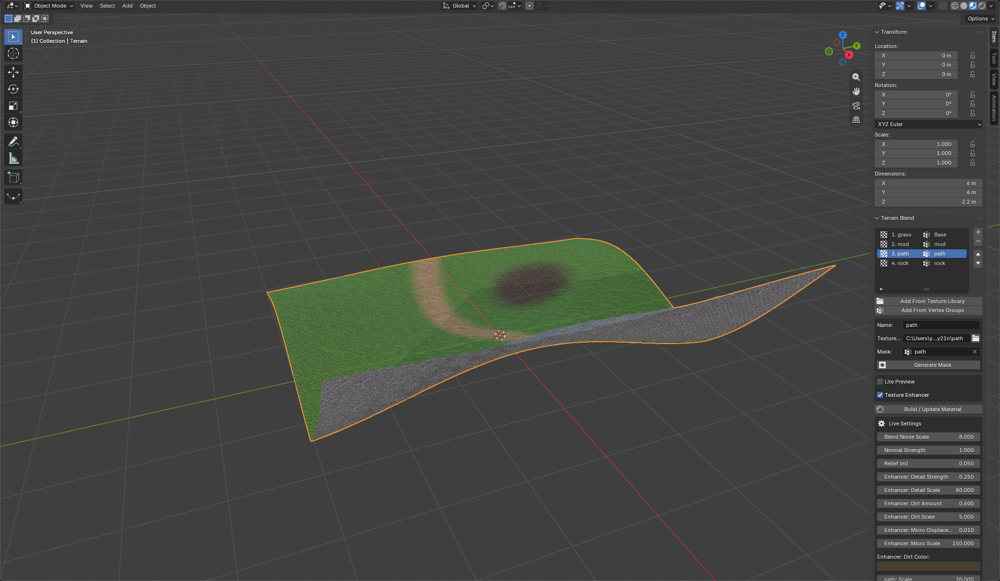
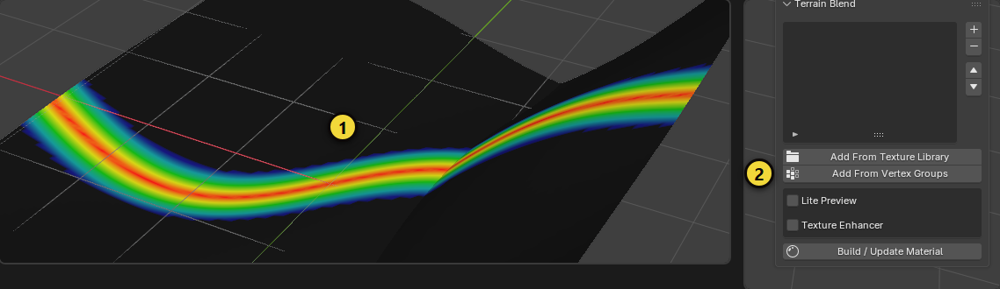
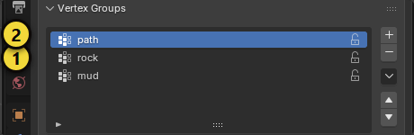
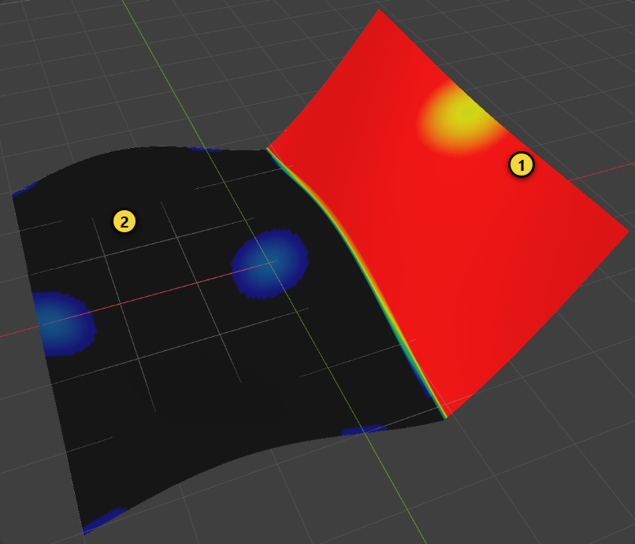
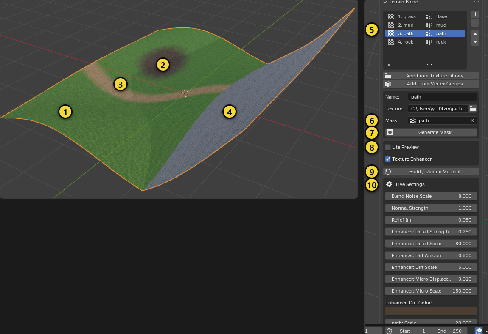

# Terrain Blend

Blend any number of PBR texture sets on one mesh. Each set (grass, path, rock, mud ...) is a **layer**; a **vertex
group** says where the layer is visible. The add-on builds the material and a small Geometry Nodes modifier for you and
keeps everything adjustable with live sliders.

[Türkçe](terrain_blend.tr.md) · [Back to the overview](../README.md)



## Quick start

1. Select your terrain mesh. Create one **vertex group per surface** (`path`, `rock`, `mud` ...) and paint weights, or
   let the add-on generate them (step 4).
2. Keep each texture set in its own folder. The add-on finds the maps by file name, so downloads from ambientCG,
   Poly Haven, Poliigon, Quixel or Substance work as they are:

   | Map | Recognized words in the file name |
   |---|---|
   | Color | `color`, `col`, `basecolor`, `albedo`, `diffuse`, `diff` |
   | Normal | `normal`, `normalgl`, `normaldx`, `nor`, `nrm`, `norm` (OpenGL is preferred over DirectX) |
   | Roughness | `roughness`, `rough` |
   | Height | `height`, `displacement`, `disp`, `bump` |

   A set needs at least a color map. Missing maps are simply left out.
3. Open the **Terrain Blend** panel and press **Add From Texture Library**. Pick the folder that contains the set
   folders. Every sub-folder with a color map becomes a layer, and a vertex group with the same name becomes its mask.
   The first layer is the **base** and needs no mask. (**Add From Vertex Groups** goes the other way: one layer per
   vertex group, and you set the texture folders by hand.)
4. Select a layer and press **Generate Mask** to fill its vertex group from **slope**, **height** or **noise** instead of
   painting. Choose the range (From / To), invert it, or combine it with the existing weights (replace, intersect,
   union).
5. Press **Build / Update Material**. The material and the **TB Masks** modifier are created.
6. Tune the result with the **Live Settings** sliders. Nothing needs to be rebuilt.

## Step-by-step guide: a terrain from scratch

This guide follows one example: a grassy ground with a path through it, a mud patch and rock on the steep slope. The
yellow numbers in the pictures match the numbers in the text. Repeat the steps for your own terrain.

> **Where is the panel?** In the 3D view press `N` to open the sidebar and click the **Terrain Blend** tab. In the screenshots the
> panel appears under the **Item** tab because of how the pictures were taken; in your Blender it has its own tab.

### 1. Preparation: mesh, UVs and texture folders

- **The mesh must be dense.** A mask is per vertex, so the denser the mesh in a transition, the smoother it looks. For a
  test, add *Add > Mesh > Grid* and set X and Y Subdivisions to 100 - 200.
- **UVs:** If the mesh has a UV map the textures use it. Without one the object coordinates (Generated) are used.
- **Texture folders:** One folder per texture set, named like the vertex group that will mask it:

```
Textures/
  grass/  grass_Color.jpg  grass_NormalGL.jpg  grass_Roughness.jpg  grass_Displacement.jpg
  mud/    mud_Color.jpg    ...
  path/   path_Color.jpg   ...
  rock/   rock_Color.jpg   ...
```

- **Base layer:** Layers are added in alphabetical folder order and the first one is the base. Here `grass` is first, so
  it becomes the base. If another set should be the base, move that layer up with the arrow afterwards.

### 2. Create and paint the vertex groups



1. Select the mesh. In the Properties editor (bottom right) open the **Object Data** tab (green triangle) and, under
   **Vertex Groups**, add one group per surface with `+`: `path`, `mud`, `rock`. The base (`grass`) needs no group.

   

2. Switch to **Weight Paint** in the mode menu, pick the group in the list and paint. **Red = the layer is fully visible**,
   **blue = invisible** (1 in the picture above). Thin shapes like a path are best painted by hand.
3. When you are done go back to **Object Mode**. The Terrain Blend panel (the buttons marked 2) is in the N sidebar, on the
   **Terrain Blend** tab.

> For groups you do not want to paint, use **Generate Mask** in step 4.

### 3. Add the layers

1. Press **Add From Texture Library** (2) and choose the `Textures` folder.
2. The layers `grass`, `mud`, `path`, `rock` appear. The vertex group with the same name becomes each layer's mask (5 in the
   picture below).
3. Look at each row: a **red warning icon** on the left means the texture folder is missing, and *no mask* on the right means
   no vertex group is chosen. Select that layer and complete it in the **Name / Texture / Mask** fields below the list.

*Alternative:* If you created the vertex groups first, **Add From Vertex Groups** adds one layer per group and you choose
the texture folders yourself.

### 4. Generate masks automatically



Let rock show only on steep slopes:

1. Select the `rock` layer and press **Generate Mask**.
2. In the dialog set *Vertex Group* `rock`, *Source* **Slope**, *From* **25**, *To* **45** and confirm.
3. The result looks like the picture above: **1** steep ground (red, rock shows), **2** flat ground (weight 0).

More recipes:

| You want | Source | From - To | Note |
|---|---|---|---|
| Rock on steep slopes | Slope | 25 - 45 (degrees) | 0 = flat, 90 = vertical wall |
| Rock or snow up high | Height | 8 - 14 (meters) | World height; it changes if you move the object |
| Grass on flat ground | Slope + **Invert** | 20 - 40 | Everything that is not steep |
| Scattered mud patches | Noise | 0.4 - 0.6 | *Noise Scale* sets the patch size, *Seed* changes the pattern |
| Steep **and** high | Slope, then Height | *Combine*: **Intersect** | Both conditions together |
| Steep **or** high | Slope, then Height | *Combine*: **Union** | Either condition |

Use *Combine* to merge an automatic mask with what you painted; *Replace* overwrites the old weights.

### 5. Build the material and see the result



1. Press **Build / Update Material** (9). A material named `<object name> Terrain` and the **TB Masks** modifier are created.
2. Switch the 3D view to **Material Preview** (sphere icons in the header). The result looks like the picture: **1** grass
   (base), **2** mud, **3** path, **4** rock.
3. Select a layer in the list: **Live Settings** (10) shows that layer's settings. Changing them needs no rebuild.

### 6. Tune the look

| Problem | What to do |
|---|---|
| The texture is too large or too small | The layer's **Scale**: a bigger value repeats the texture more (smaller). Try 40 - 80 for grass, 15 - 25 for rock |
| Transitions look like a flat brush stroke | Raise **Noise** and **Height Influence**; the edge then follows the texture height |
| The transition edge is too sharp | Raise **Softness** |
| The surface looks too flat | Raise **Relief (m)** and **Normal Strength** |
| The same pattern shows everywhere | Change **Blend Noise Scale**, turn on **Texture Enhancer** |

**Texture Enhancer** (the box under 8 in the picture) adds fine detail, crevice dirt and micro displacement without extra
files; its sliders are at the bottom of Live Settings, named *Enhancer*. **Lite Preview** uses only the color and height
maps: it keeps the surface from turning pink with many layers on the OpenGL EEVEE backend (Blender 5.0). Switch it off for
the final look.

### 7. Render

- **EEVEE:** works up to 49 layers. In Blender 5.2 pick **Preferences > System > GPU Backend: Vulkan**.
- **Cycles:** for real displacement set *Material Properties > Settings > Surface > Displacement* to
  **Displacement and Bump** and make sure the mesh is dense.

### 8. Changing things later

- **A new surface:** Add a vertex group, add a layer with `+`, choose the folder and the mask, press
  **Build / Update Material**. Your slider values are kept.
- **Removing a layer or changing the order:** `-` and the arrows. A layer lower in the list is painted over the one above.
- **If the modifier was deleted:** **Build / Update Material** puts it back.

### Common problems

| Symptom | Cause and fix |
|---|---|
| The surface is pink | The EEVEE texture limit was exceeded. Turn on **Lite Preview**, switch to Vulkan (5.2) or use Cycles |
| A layer never shows | Its mask vertex group is empty or misnamed. Check it in Weight Paint and fill the layer's **Mask** field |
| "Texture ... not found" | No file name in the folder contains a known word such as `Color`, `Albedo` or `Diffuse` |
| The surface is lit upside down | A DirectX normal map is in use. Put the OpenGL (`NormalGL`) version in the folder |
| Transitions look blocky | The mesh is too coarse. Subdivide it or use a denser grid |
| Textures are missing on another computer | Textures are read from their folders. Use **File > External Data > Pack Resources** |

## Panel reference

| Control | What it does |
|---|---|
| Layer list (+ / - / arrows) | Add, remove and reorder layers. Later layers are painted on top of earlier ones. |
| Name, Texture Folder, Mask | The layer's name, its texture set folder and the vertex group that decides where it shows. |
| Generate Mask | Fill the mask from slope (degrees), height (meters) or noise (0 to 1, with scale and seed). |
| Lite Preview | Use only the color and height maps (2 textures per layer). Use it for many layers on EEVEE with the OpenGL backend. Switch it off for the final look. |
| Texture Enhancer | Procedural fine detail normal, crevice dirt and micro displacement on top of the textures. No extra image files. |
| Build / Update Material | Rebuild the material and the modifier. Slider values you set are kept. |

**Live Settings** (global): Blend Noise Scale (breaks up the edges between layers), Normal Strength, Relief (height in
meters). **Per layer**: Scale (texture tiling), Softness, Height Influence (let the height map push the transition),
Noise. **Enhancer**: Detail Strength and Scale, Dirt Amount and Scale, Dirt Color, Micro Displacement and Scale.

## How many layers can I use?

There is no limit set by the add-on. The limits come from the render engine, and the panel warns you before you hit
them:

| Engine | Limit | What to do |
|---|---|---|
| Cycles | None that matters | Use it for final renders. |
| EEVEE, Vulkan backend (Blender 5.2) | Up to 256 textures, 49 layers | Fine for large sets. |
| EEVEE, OpenGL backend (Blender 5.0, or 5.2 on OpenGL) | About 30 textures. With 4 maps per layer that is 7 layers; above it surfaces turn pink | Turn on **Lite Preview** (2 maps per layer, 14 layers) or use Cycles. |
| EEVEE, any backend | 49 layers (a GPU attribute limit: masks are packed 4 per attribute) | Use Cycles for more. |

Tested with 14-layer and 49-layer materials in Blender 5.0.1 and 5.2.0.

## Good to know

- Masks reach the shader through a Geometry Nodes modifier named **TB Masks**. If you apply or remove it, press
  **Build / Update Material** to put it back.
- Blender 5.0 EEVEE cannot read vertex groups directly in a material. That is why the add-on packs them into color
  attributes. You do not need to do anything; it works the same on 5.0 and 5.2.
- Each object keeps its own layer list, so different terrains can use different sets.
- Textures are referenced from their folders, not copied. Keep the folders where they are, or use
  **File > External Data > Pack Resources** before sharing the .blend file.

## Limits

- The base layer always covers the whole mesh.
- Auto masks work per vertex, so a low-poly mesh gives coarse masks. Subdivide the mesh or paint the group yourself for
  fine control.
- The tests use grids of about ten thousand vertices. The material itself does not depend on the vertex count, but
  **Generate Mask** loops over every vertex, so expect it to take longer on very dense meshes.
