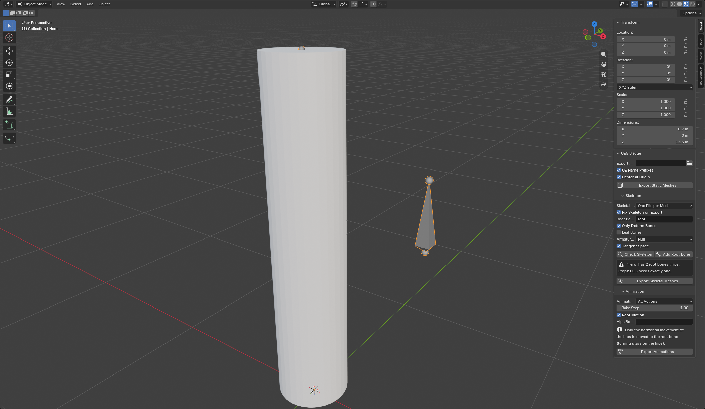
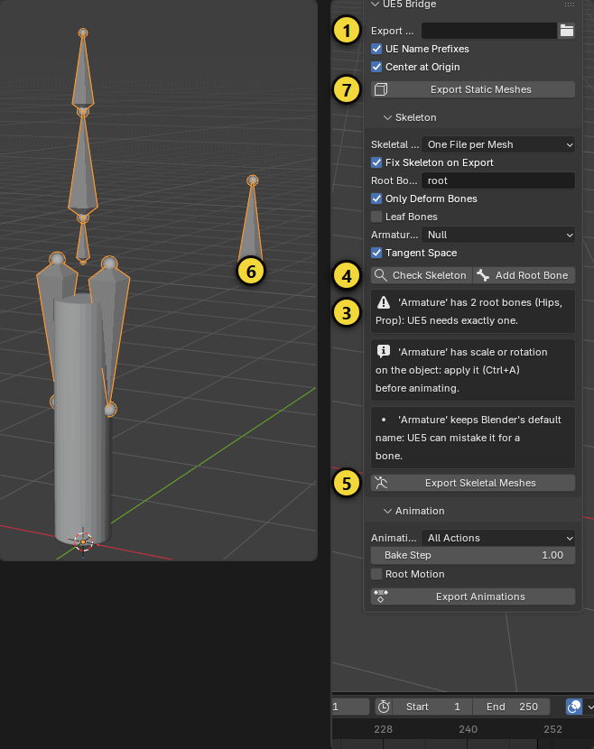
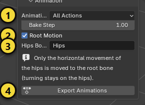
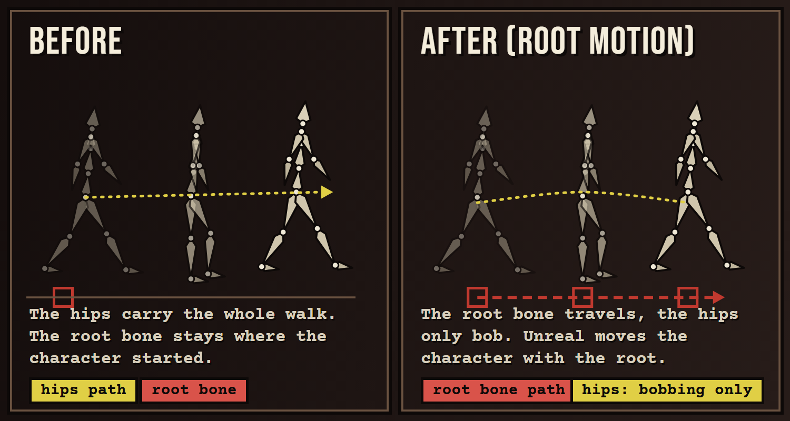

# UE5 Bridge

Clean FBX export from Blender to Unreal Engine 5: static meshes, modular skeletal meshes that share one skeleton,
animations (one file per action or NLA track) and optional root motion. Every export works on temporary copies of your
objects, so nothing in your scene is moved, applied or renamed.

[Türkçe](ue5_bridge.tr.md) · [Back to the overview](../README.md)

> **Status.** The exported files were checked by importing them back into Blender (bone hierarchy, sizes, animation
> length, root motion). The add-on was **not** tested inside Unreal Engine, because none was available. The settings
> follow Epic's FBX guidance; the one setting that may need a try in Unreal is **Armature Node** (see Troubleshooting).

The panel is in the sidebar tab **UE5**.

## Step-by-step guide

This part explains three workflows from Blender to Unreal Engine 5: a **static mesh**, a **skeletal character** (with modular
parts) and an **animation** (with root motion). The yellow numbers in the pictures match the numbers in the text.

> **Where is the panel?** In the 3D view press `N` to open the sidebar and click the **UE5** tab (in the screenshots it appears
> under the *Item* tab because of how the pictures were taken). **On the Unreal side:** the steps in Unreal Engine follow Epic's
> FBX import workflow. The files of this add-on were checked by importing them back into Blender; they were **not tried** in
> Unreal itself.

### A. Static mesh (rock, crate, building)

1. Select the meshes. Modifiers are applied during export; you do nothing.
2. At the top of the panel choose the **Export Folder** (1). The `StaticMeshes`, `SkeletalMeshes` and `Animations` folders are
   created in it.
3. With **UE Name Prefixes** on, files start with `SM_`; with **Center at Origin** on, every part is exported at (0, 0, 0),
   while its place in your scene does not change.
4. Press **Export Static Meshes** (7). One FBX per mesh: `StaticMeshes/SM_Crate.fbx`.
5. **In Unreal:** drag the FBX into the *Content Browser* or use *Import*. The default options are fine for a static mesh. The size
   comes out right: 1 Blender meter becomes 100 Unreal centimeters.

### B. Skeletal character

1. **Prepare.** Give the armature a real name (`Hero`, not `Armature`): Unreal can mistake that name for a bone. Apply the
   object's scale and rotation (`Ctrl+A`). In the picture the armature has scale 2, the default name and **two root bones**
   (6: `Hips` and `Prop`).
2. Select the armature or its mesh and press **Check Skeleton** in the **Skeleton** section (2). The add-on lists the problems
   **without changing anything** (3):
   - *'Armature' has 2 root bones*: Unreal needs **exactly one** root bone.
   - *has scale or rotation on the object*: apply scale and rotation.
   - *keeps Blender's default name*: rename the armature.
3. There are two ways to fix the root bone:
   - **Do nothing.** With **Fix Skeleton on Export** on, the add-on adds a single root bone called `root` on the export **copy**
     and parents the others to it. Your scene does not change.
   - Or press **Add Root Bone** (4): it applies the same fix to the real skeleton.
4. Important options: **Only Deform Bones** (leaves control and helper bones out), **Leaf Bones** (keep it off; when on, Unreal
   shows phantom bones at the end of every chain).
5. For **Skeletal Meshes** choose: **One File per Mesh** is for modular parts (trousers, jacket, shoes); they all share one
   skeleton and fit together in Unreal. **One File** puts everything in a single FBX.
6. Press **Export Skeletal Meshes** (5). Output: files like `SkeletalMeshes/SK_Hero_body.fbx`.
7. **In Unreal:** drag the FBX in. When importing the first part leave **Skeleton** at *None*; Unreal creates the skeleton asset.
   For the next parts choose **the same skeleton asset**.

### C. Animation and root motion

First prepare your animations in Blender as **actions** (for example `idle`, `walk`, `run`). Give each one a **Fake User** (shield
icon) or place it in the NLA so unused actions are saved.

1. Select the armature. In the **Animation** section choose the source (1):
   - **All Actions**: every action that animates this skeleton becomes a file (recommended).
   - **NLA Tracks**: every NLA track becomes a file. **Active Action**: only the action assigned right now.
2. **Bake Step**: 1 (a key on every frame). All bones are baked.
3. To export a walking animation with root motion turn on **Root Motion** (2). In **Hips Bone** (3) type the name of the hips bone
   (`Hips`, `pelvis`, `mixamorig:Hips` ...). If you leave it empty the name is guessed from words like `hips` or `pelvis`.
4. Press **Export Animations** (4). Output: `Animations/A_Hero_walk.fbx`, one file per action.

**What does root motion do?**

- **Before:** the walk lives in the movement of the hips; the root bone stays where it started. Unreal looks at the root bone to move
  the character, so the character advances in the animation but stands still in the world.
- **After:** the **horizontal movement** of the hips (forward, sideways) is moved onto the root bone on every frame. Only a small
  bobbing stays on the hips, and the final pose of every frame is exactly what you animated. Unreal moves the character with the
  root bone.
- Turning (yaw) is not extracted; it stays on the hips.

Rules:

- The hips must either be the **only root** (the add-on adds a root bone above them) or hang **directly under** the root. If they
  are deeper the export stops with a message.
- Root motion does not work with **NLA Tracks** (tracks can blend several actions); you get a message.

**Animation in Unreal:** drag the FBX in, choose the skeleton asset that was created before as **Skeleton** and turn **Import Mesh**
off. For root motion open the animation asset and tick **Enable Root Motion** under *Asset Details*.

### Checking without Unreal

You can check an exported file by importing it back into Blender (*File > Import > FBX*): a single root bone, no phantom `_end`
bones, the right size and animation length. The add-on's test does exactly this automatically.

### Common problems

| Symptom | Cause and fix |
|---|---|
| Unreal shows an extra root bone or the character is rotated | Set **Armature Node** to *Root* or *Limb Node* and export again. It is the one setting that could not be tried in Unreal |
| The character is 100 times too small or large | Keep the Blender scene unit scale at 1 and do not apply scale twice. The export uses FBX Units Scale |
| Phantom bones at the end of every chain | **Leaf Bones** must be off |
| The animation plays but the character does not advance | Turn on **Root Motion**, export, and tick **Enable Root Motion** on the animation in Unreal |
| "Root motion needs actions, not NLA tracks" | Set the source to **All Actions** or **Active Action** |
| "Could not find the hips bone" | Type the exact name of the hips bone in **Hips Bone** |
| An action was not exported | Give it a Fake User or assign it to the armature; empty actions and actions that do not animate this skeleton are skipped |

## What the exports use

These FBX settings are fixed on purpose, because they are the ones that import into Unreal at the right size and
orientation: Apply Scalings = *FBX Units Scale* (1 Blender meter becomes 100 Unreal centimeters), default axes
(-Z forward, Y up), face smoothing, tangent space (optional), no leaf bones, primary bone axis Y. File names are made
safe for Unreal: ASCII letters, digits and underscores, Blender's `.001` suffix removed.

## Static meshes

1. Select the meshes.
2. Set the **Export Folder** (a `StaticMeshes` folder is created inside it).
3. Press **Export Static Meshes**. One FBX per mesh, modifiers applied, rotation and scale baked in.

| Option | What it does |
|---|---|
| UE Name Prefixes | Names the files `SM_` (static), `SK_` (skeletal), `A_` (animation) unless the name already starts that way. |
| Center at Origin | Exports every part at (0, 0, 0), wherever it sits in the scene. |

Skinned meshes are skipped here; export them as skeletal meshes.

## Skeletal meshes

Select the armature (or its meshes) and press **Export Skeletal Meshes**. Files go to `SkeletalMeshes`.

| Option | What it does |
|---|---|
| Skeletal Meshes: One File per Mesh | Modular parts (trousers, jacket, shoes) are exported one by one, all sharing the same skeleton, so they fit together in Unreal. |
| Skeletal Meshes: One File | The skeleton and all its meshes in a single FBX. |
| Fix Skeleton on Export | Unreal needs exactly one root bone. If the skeleton has several, a root bone (named by **Root Bone**, default `root`) is added above them **on the export copy only**. |
| Only Deform Bones | Leaves control and helper bones out of the file. |
| Leaf Bones | Off by default. When on, Blender adds an extra end bone to every chain, which Unreal shows as phantom bones. |
| Armature Node | How the armature object itself is written (*Null*, *Root*, *Limb Node*). |
| Tangent Space | Writes tangents. |

**Check Skeleton** lists problems without changing anything: more than one root bone, no deform bones, scale or rotation
on the armature object, and the default name `Armature` (Unreal can mistake it for a bone). **Add Root Bone** fixes the
root problem on the real skeleton, if you want it fixed in the .blend file as well.

## Animations

Select the armature and press **Export Animations**. Files go to `Animations`, named `A_<armature>_<animation>.fbx`.

| Option | What it does |
|---|---|
| Animations: All Actions | Every action that animates this skeleton, one file each. |
| Animations: NLA Tracks | Every NLA track becomes its own file, named after the track. |
| Animations: Active Action | Only the action assigned to the armature now. |
| Bake Step | Frames between baked keys (1 = every frame). All bones are baked. |
| Root Motion | See below. |
| Hips Bone | Name of the hips bone for root motion. Leave empty to guess from the name (hips, pelvis ...). |

### Root motion

Unreal drives a character with the root bone (Root Motion, Motion Matching). With **Root Motion** on, the horizontal
movement of the hips (forward, sideways) is moved onto the root bone for every frame. The hips keep only what is left
over (bobbing, sway), and the final pose of every frame stays exactly what you animated. Turning is not extracted: it
stays on the hips.

- If the hips are the only root, a new root bone is added above them (on the export copy).
- If the hips sit deeper in the hierarchy than directly under the root, the export stops with a message.
- Root motion works with actions. With **NLA Tracks** it is refused with a message, because tracks can blend several
  actions.

## Typical workflow

1. Build the skeleton once, apply object scale and rotation (`Ctrl+A`), and give the armature a real name (`Hero`, not
   `Armature`).
2. **Check Skeleton**.
3. **Export Skeletal Meshes** once: import it into Unreal and let it create the skeleton asset.
4. **Export Animations**; when importing into Unreal, pick that existing skeleton so all animations share it.

## Troubleshooting

- **Unreal shows an extra root bone or the character is rotated.** Try another **Armature Node** value (*Root* or
  *Limb Node*). This was the one setting that could not be tested in Unreal.
- **The character is 100 times too small or too big.** Make sure the Blender scene unit scale is 1 and that you are not
  applying scale twice. The exports use FBX Units Scale.
- **Phantom bones at the end of every chain.** Keep **Leaf Bones** off.
- **Animation plays but the character does not move in the world.** Turn on **Root Motion** and enable root motion on the
  animation asset in Unreal.

## Limits

- Not verified inside Unreal Engine itself (see the status note).
- Root motion extracts translation only, no yaw (turning).
- Only the FBX path is covered. Alembic, USD and the Unreal Python API are not used.
